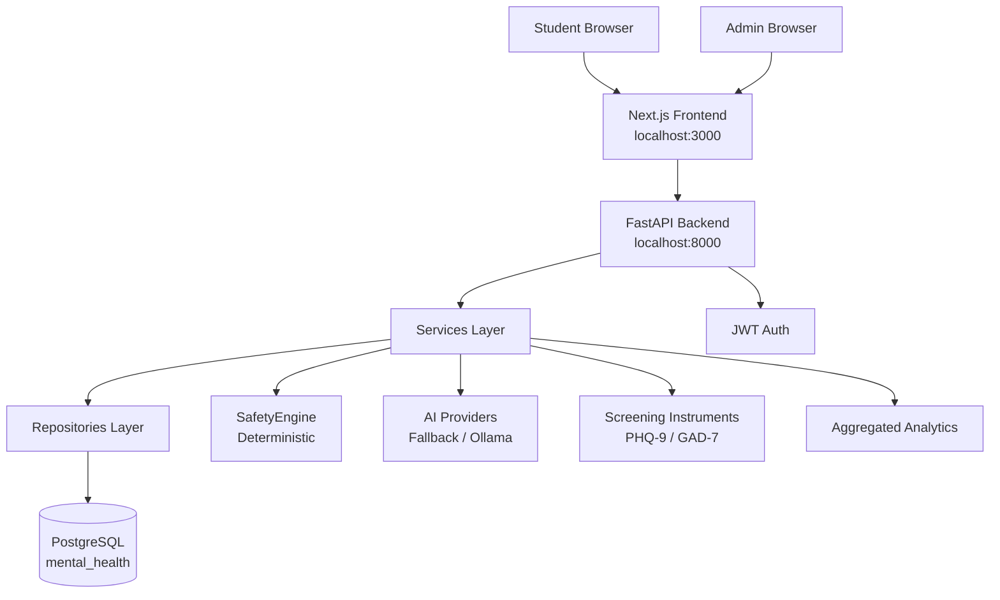
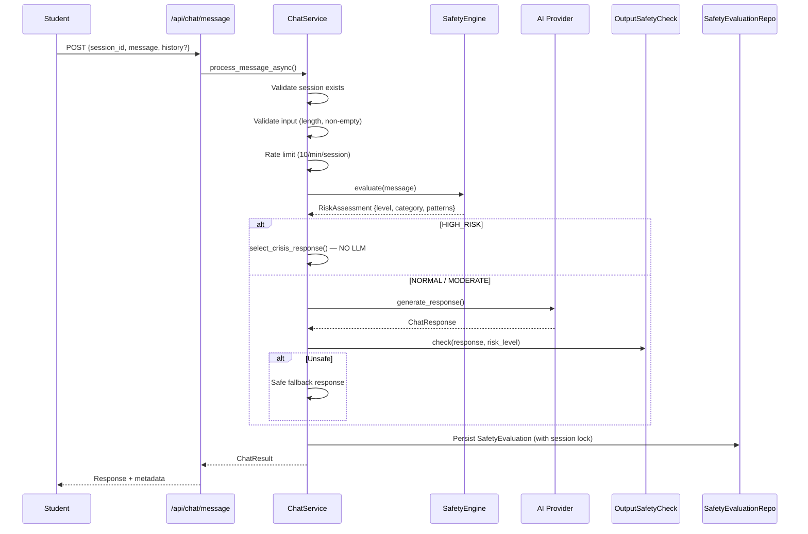
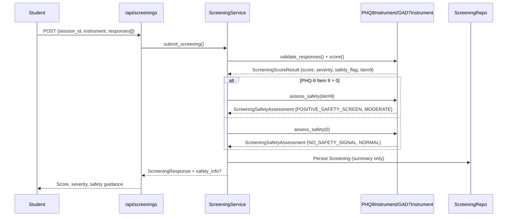
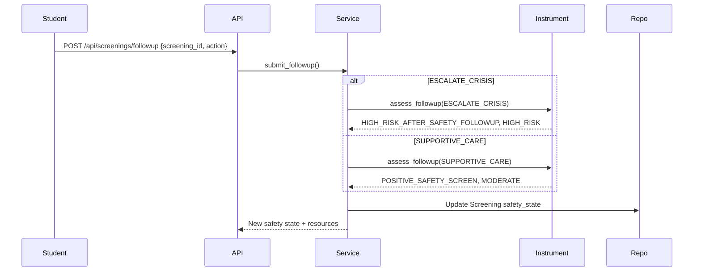
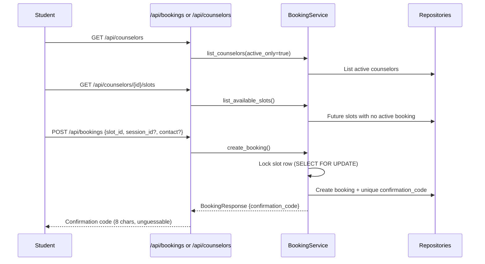
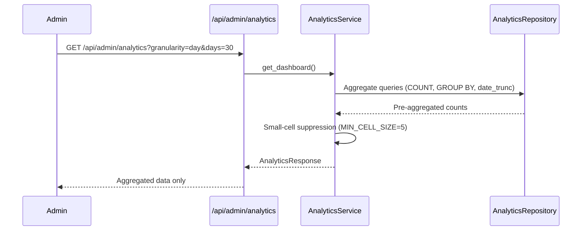

# Architecture — Current System (Milestones 1–12)

This document describes the **current implemented architecture** as of Milestone 12.
All features listed here exist in the codebase.

---

## High-Level Overview



---

## Layer Responsibilities

| Layer | Directory | Responsibility |
|-------|-----------|----------------|
| **API Routes** | `backend/app/api/routes/` | HTTP endpoints, request/response validation, auth dependencies |
| **Services** | `backend/app/services/` | Business logic, orchestration, transaction boundaries |
| **Repositories** | `backend/app/repositories/` | Data access, SQL queries, no business logic |
| **Models** | `backend/app/models/` | SQLAlchemy ORM models, table definitions |
| **Schemas** | `backend/app/schemas/` | Pydantic request/response models |
| **Safety** | `backend/app/safety/` | Deterministic safety engine, crisis responses |
| **Screening** | `backend/app/screening/` | PHQ-9 / GAD-7 scoring, safety assessment |
| **Core** | `backend/app/core/` | Config, DB engine, language support |

---

## Major Data Flows

### 1. Chat Pipeline



**Key Properties:**
- **SafetyEngine is authoritative** — risk is never decided by the LLM
- **HIGH_RISK bypasses the LLM entirely** — predetermined crisis response
- **OutputSafetyCheck** — defense in depth on AI responses
- **Only metadata persisted** — raw message text is NEVER stored
- **Session-level locking** — serializes concurrent messages per session

---

### 2. Screening Flow (PHQ-9 / GAD-7)



**Follow-up (PHQ-9 Item 9 > 0):**


**Privacy:** Only summary metrics stored (total_score, severity, safety_flag, item9_score).
**Raw item responses are NEVER persisted.**

---

### 3. Booking Flow



**Anonymous-first:** No session or contact required. Ownership proven by:
- Matching `session_id` (if provided at booking), OR
- `confirmation_code` (returned at creation)

**Admin booking management** (`/api/admin/*`):
- Full CRUD on counselors, slots, bookings
- Status state machine: `PENDING → CONFIRMED / COMPLETED / CANCELLED`
- **Privacy:** Admin responses NEVER expose session_id, chat history, screening data, or safety evaluations

---

### 4. Analytics Flow (Admin Only)



**Privacy Rules Enforced:**
1. **Aggregate-only** — no row-level student/booking/screening/safety data
2. **Domain separation** — wellbeing (sessions, screenings, safety) NEVER joined to booking domain
3. **Small-cell suppression** — sensitive cells < 5 returned as `count: null, suppressed: true`
4. **No provider metrics** — chat provider not persisted (only deterministic classifier sources stored)

---

## Database Schema

### Core Tables (Wellbeing Domain)

| Table | Purpose | Key Columns |
|-------|---------|-------------|
| `sessions` | Anonymous student sessions | `id` (UUID), `language`, `created_at`, `updated_at` |
| `safety_evaluations` | Per-message safety assessment | `id`, `session_id`, `message_index`, `risk_level`, `category`, `matched_patterns` (JSONB), `classifier_sources` (JSONB), `language`, `created_at` |
| `screenings` | PHQ-9/GAD-7 summary results | `id`, `session_id`, `instrument`, `total_score`, `severity`, `safety_flag`, `item9_score`, `created_at` |

### Booking Domain (Separate)

| Table | Purpose | Key Columns |
|-------|---------|-------------|
| `counselors` | University counseling staff | `id`, `name`, `title`, `areas_of_support` (JSONB), `bio`, `is_active` |
| `counselor_slots` | Availability windows | `id`, `counselor_id`, `starts_at`, `ends_at` |
| `bookings` | Appointments | `id`, `slot_id`, `session_id` (nullable), `confirmation_code` (unique), `student_name`, `contact_email`, `contact_phone`, `reason`, `status` (PENDING/CONFIRMED/CANCELLED/COMPLETED), `admin_notes` |

### Admin Domain

| Table | Purpose | Key Columns |
|-------|---------|-------------|
| `admins` | Admin accounts | `id`, `username` (unique), `password_hash` (bcrypt), `is_active` |

---

## Privacy Boundaries

```
┌─────────────────────────────────────────────────────────────────┐
│                      WELLBEING DOMAIN                           │
│  sessions → safety_evaluations → screenings                     │
│  (chat, safety, screening — student mental health data)        │
└─────────────────────────────────────────────────────────────────┘
                              │
                    NEVER JOINED
                              │
┌─────────────────────────────────────────────────────────────────┐
│                      BOOKING DOMAIN                             │
│  counselors → counselor_slots → bookings                        │
│  (operational — counselor schedules, appointments)              │
└─────────────────────────────────────────────────────────────────┘
                              │
                    NEVER JOINED
                              │
┌─────────────────────────────────────────────────────────────────┐
│                      ADMIN DOMAIN                               │
│  admins (auth only)                                             │
└─────────────────────────────────────────────────────────────────┘
```

- **Analytics queries** run separately on each domain
- **No cross-domain joins** in any query
- **Admin booking endpoints** return only booking metadata (no session/wellbeing data)

---

## Safety Architecture

### Deterministic SafetyEngine (Authoritative)

Location: `backend/app/safety/`

1. **Normalize** — Unicode-aware, preserves Devanagari/Bengali scripts
2. **Classify** — KeywordClassifier (regex-based, extensible via `RiskClassifier` protocol)
3. **Map to Risk Level** — Fixed mapping: SUICIDE/SELF_HARM/PASSIVE_SI/ABUSE → HIGH_RISK
4. **Fail-closed** — If all classifiers fail → HIGH_RISK
5. **Input limit** — 2000 chars enforced at engine boundary

### Crisis Flow

`HIGH_RISK` → `select_crisis_response()` → Fixed warm message + verified helplines
- **NO LLM invoked** for HIGH_RISK messages
- Category-specific responses: suicide/self-harm, passive SI, abuse

### Output Safety Check

Location: `backend/app/services/output_safety.py`

Runs on **AI/fallback responses only** (defense in depth):
- Rejects unsafe patterns (self-harm encouragement, medical advice, diagnosis claims, prompt injection)
- Rejects hallucinated phone numbers/helplines (crisis numbers are SYSTEM-CONTROLLED)
- On failure → guaranteed-safe fallback response

---

## AI Provider Architecture

### Abstraction: `ChatResponseProvider` (Protocol)

```python
async def generate_response(
    message: str,
    assessment: RiskAssessment,
    language: str,
    history: list[dict] | None = None,
    screening_context: dict | None = None,
) -> ChatResponse
```

### Concrete Providers

| Provider | Class | Use Case |
|----------|-------|----------|
| **Deterministic Fallback** | `DeterministicFallbackProvider` | Default, no LLM needed, keyword-based templates |
| **Ollama (Local)** | `OllamaProvider` | Local LLM via Ollama, model `qwen3:8b` |

### Provider Selection

Controlled by `AI_PROVIDER` env var:
- `fallback` (default) — deterministic, no external dependency
- `ollama` — local Ollama server

### Key Behaviors

- **Provider output validated** — empty/runaway responses rejected → safe fallback
- **Qwen3 thinking handled** — `think: true` separates reasoning (discarded) from answer
- **Output safety check** — runs on ALL provider responses
- **Graceful degradation** — Ollama failure → deterministic fallback

---

## Authentication & Authorization

### Student (Anonymous)

- No accounts, no login
- Session = UUID + language code
- Created via `POST /api/sessions`

### Admin (JWT)

- `POST /api/admin/auth/login` → JWT access token (HS256, hard-pinned)
- Token in `Authorization: Bearer <token>` header
- All `/api/admin/*` routes require valid token
- Login throttled per (username, IP) and per IP
- Passwords bcrypt-hashed
- Timing-safe error messages (no user enumeration)

---

## Rate Limiting

| Endpoint | Limit | Implementation |
|----------|-------|----------------|
| `/api/chat/message` | 10 req/min/session | In-memory sliding window (per session) |
| `/api/admin/auth/login` | 5 failures/15min/user, 20/15min/IP | In-memory with lockout |

---

## Configuration

All runtime config via environment variables (`.env` files, never committed):

| Variable | Purpose | Default |
|----------|---------|---------|
| `DATABASE_URL` | PostgreSQL connection | (required) |
| `ENVIRONMENT` | `development` \| `test` \| `production` | `development` |
| `CORS_ORIGINS` | Allowed browser origins | `["http://localhost:3000"]` |
| `AI_PROVIDER` | `fallback` \| `ollama` | `fallback` |
| `OLLAMA_BASE_URL` | Ollama server URL | `http://localhost:11434` |
| `OLLAMA_MODEL` | Model name | `qwen3:8b` |
| `OLLAMA_TIMEOUT_SECONDS` | Request timeout | `3.5` (dev), `120` (CPU) |
| `OLLAMA_ENABLE_THINKING` | Send `think: true` | `true` |
| `ADMIN_AUTH_SECRET` | JWT signing secret | (required in prod) |
| `ADMIN_AUTH_TOKEN_EXPIRE_MINUTES` | Token lifetime | `1440` (24h) |

---

## Testing

- **Backend:** `pytest` — 326 test functions, dedicated test database (`mental_health_test`)
- **Frontend:** `npm run lint` (ESLint), `npm run build` (type-check + production build)
- **Test isolation:** `conftest.py` provisions test DB, applies migrations, truncates between tests

---

## Deployment Notes

- **Single-container or multi-service** — backend, frontend, PostgreSQL
- **Ollama optional** — runs separately if `AI_PROVIDER=ollama`
- **Production requirements:**
  - Strong `ADMIN_AUTH_SECRET` (`openssl rand -hex 32`)
  - `ENVIRONMENT=production`
  - PostgreSQL with connection pooling
  - Reverse proxy (nginx) for TLS, rate limiting
  - Shared store for login throttling if multi-worker (Redis)