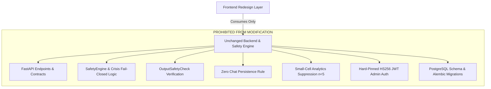

# Comprehensive Frontend UI/UX Redesign & Brand Architecture Strategy

**Document Role**: Senior Product Designer · UX Researcher · Design-System Architect · Hackathon Product Judge  
**Status**: Proposal & Research Direction Only (Zero code changes, zero commits)  
**Target Repository**: `syazy-bit/mental-health-app`  
**Date**: 2026-08-21  

---

## 1. Executive Verdict & Current UI Audit

### Verdict on Phase 1 & 2 Foundation
> **Is the current Phase 1/2 foundation visually sufficient?**  
> **Verdict: NO.**  
>
> While the Phase 1 & 2 tokenization and UI primitives established clean semantic CSS variables, accessible focus rings, and proper layout wrappers, **the overall visual experience remains fundamentally that of a functional student project**. 
>
> It lacks the distinctive visual hierarchy, spatial confidence, emotional resonance, typography dynamics, and micro-delights that define modern, high-trust platforms like *Headspace*, *Modern Health*, *Calm*, or *Linear*. 
>
> Making an application truly feel production-ready cannot be achieved by merely tweaking border radii and background colors. It requires a **fundamental rethinking of page composition, visual storytelling, conversational ergonomics, cognitive pacing, and brand identity**.

---

## 2. Deep UI/UX Audit of the Current Experience

| Screen / Area | Current Shortcomings & "Generic" Trait | Cognitive & Emotional Failure Mode |
|---|---|---|
| **1. Landing Page (`/`)** | Traditional 2x2 grid of cards with generic text; plain centered hero; disconnected starter chips at the bottom. | **High cognitive load**: A stressed student looking at 4 identical-weight boxes must read all of them to figure out where to go. Lacks an immediate emotional anchor. |
| **2. Chat (`/chat`)** | Generic chat box with basic rounded bubbles and simple placeholder text; looks like a generic LLM wrapper. | **Impersonal & Clinical**: Feels like talking to a sterile chatbot rather than entering a calm, confidential, empathetic sanctuary. Starter pills are static and uninspiring. |
| **3. Screening (`/screening`, `/phq9`, `/gad7`, `/result`)** | Traditional form pagination; radio list with plain text labels; results card shows raw numbers with basic text explanations. | **Feels like a medical questionnaire**: Can provoke clinical anxiety or fear of diagnosis. The results page does not celebrate self-reflection or clearly contextualize scores as transient states. |
| **4. Resources (`/resources`)** | Long list of helpline cards with plain telephone numbers and basic tab switching; dense text walls. | **Overwhelming in distress**: In an emotional emergency, scrolling through dense paragraphs to find a phone number increases panic. Self-care tools are buried. |
| **5. Counseling Booking (`/booking/...`)** | Standard directory with basic avatars; generic slot list; multi-step form looks like an appointment scheduler for a dental clinic. | **Friction & Hesitation**: Students already feel stigma/reluctance when booking counseling. A generic corporate form increases drop-off. |
| **6. Support Now (`/support-now`)** | Standard card listing with amber alert styling. | **Lacks grounding calm**: Needs immediate, high-contrast, distraction-free emergency access (1-tap dialer) combined with grounding exercises (e.g. 4-7-8 breathing) to physically de-escalate anxiety. |
| **7. Admin Portal (`/admin/...`)** | Basic table views and standard layout. | **Cluttered**: Analytics and bookings need clear, visual data density and high-trust status typography. |

---

## 3. Brand & Product Identity Evaluation

### Evaluation of Current Name: *"MindBridge — Student Well-being"*
- **Pros**: Clear, non-threatening, easily recognizable.
- **Cons**: Highly generic. "MindBridge" is one of the most common hackathon/demo project names and is used by dozens of unrelated SaaS and AI companies. It sounds like an enterprise corporate wellness vendor or an academic research project rather than an intimate, student-first sanctuary.

### 8 Proposed Brand Directions

```
┌─────────────────────────────────────────────────────────────────────────┐
│                    BRAND PERSONALITY SPECTRUM                           │
│                                                                         │
│   Clinical / Academic  ◄───────────────────────────►  Warm / Sanctuary │
│       [MindBridge]             [Aura / Spero]             [Solace]      │
│       [Sanctuary]              [Haven / Kith]             [Breathe]     │
└─────────────────────────────────────────────────────────────────────────┘
```

1. **Solace (Recommended)**  
   - *Meaning*: Comfort or consolation in a time of distress or sadness.  
   - *Personality*: Warm, gentle, safe, deeply human, quiet authority.  
   - *Tagline*: *"A quiet space for your mind."*  
   - *Visual Symbol*: Two gently interlocking organic leaves forming a protective shield.  
   - *Why it wins*: Immediately evokes emotional relief and peaceful confidentiality without sounding clinical.

2. **Haven**  
   - *Meaning*: A place of safety or refuge.  
   - *Personality*: Protective, grounding, approachable, reliable.  
   - *Tagline*: *"Confidential student support, whenever you need it."*  
   - *Visual Symbol*: An open geometric archway / sheltering canopy.

3. **Kith**  
   - *Meaning*: Old English for familiar friends, community, and known relations.  
   - *Personality*: Peer-supported, non-judgmental, friendly, relatable.  
   - *Tagline*: *"Support that meets you where you are."*

4. **Spero**  
   - *Meaning*: Latin for "I hope" / "to breathe with hope".  
   - *Personality*: Uplifting, forward-looking, academic yet empathetic.  
   - *Tagline*: *"Clarity, support, and hope for your university journey."*

5. **Aura**  
   - *Meaning*: A distinctive atmosphere or luminous energy.  
   - *Personality*: Modern, mindful, ambient, light.  
   - *Tagline*: *"Check in with yourself."*

6. **Anchor**  
   - *Meaning*: Stability, grounding, and steady guidance in rough waters.  
   - *Personality*: Resilient, calm, steady, reliable.  
   - *Tagline*: *"Grounding support for campus life."*

7. **Sanctuary**  
   - *Meaning*: A sacred, private haven free from judgment or intrusion.  
   - *Personality*: High privacy, protective, discreet, premium.  
   - *Tagline*: *"Your confidential campus safe space."*

8. **Nook**  
   - *Meaning*: A cozy, quiet corner tucked away from the busy world.  
   - *Personality*: Informal, student-friendly, low-barrier, gentle.  
   - *Tagline*: *"Take a breather from the noise."*

---

## 4. The New Visual Design System: "Warm Sanctuary"

```
┌─────────────────────────────────────────────────────────────────────────┐
│                      CORE COLOR PALETTE MATRIX                          │
│                                                                         │
│  [Deep Spruce Evergreen]   [Earthy Terracotta]    [Calm Slate Sage]     │
│       #0D5C56                  #D96B4F                #4A6B62           │
│    Primary Trust Anchor     Warm Action Accent    Wellness & Screening  │
│                                                                         │
│  [Warm Porcelain Canvas]    [Charcoal Ink Text]   [De-escalating Amber] │
│       #FAF9F6                  #19232D                #D97706           │
│     Soothing Surface         Crisp Readability     24/7 Crisis Urgent   │
└─────────────────────────────────────────────────────────────────────────┘
```

### 1. Spatial Rhythm & Grid Architecture
- **8px Grid System**: Every margin, padding, line-height, and container width adheres strictly to multiples of 4 and 8px.
- **Asymmetric Visual Balance**: Instead of repetitive 2x2 card grids, use intentional asymmetric hero layouts, featured master cards, and structured horizontal pathways to guide eye flow.
- **Progressive Disclosure**: Only show immediate essential information upfront; provide expandable cards and contextual drawer previews to prevent cognitive overload.

### 2. Emotional Typography
- **Display Headings**: Large, humanistic, high-character display font with tight tracking (`tracking-tight`) and balanced line heights (`leading-[1.15]`).
- **Body & Prompts**: Generous line heights (`leading-relaxed`), comfortable reading widths (max 65 characters per line), and optical contrast (`#19232D` on `#FAF9F6`).

### 3. Tactile Materials & Ambient Lighting
- **Soft Layered Ambient Shadows**: Avoid harsh solid dropshadows. Use dual-layer ambient occlusion:  
  `box-shadow: 0 1px 2px rgba(25, 35, 45, 0.04), 0 4px 16px -2px rgba(25, 35, 45, 0.06);`
- **Subtle Surface Tints**: Card surfaces utilize 98% pure white with 2% warm ivory tint, framed by crisp 1px borders in `#E6E4DD`.
- **Micro-Interactions**: Subtle button scale physics (`active:scale-[0.98]`), gentle card lift on hover (`-translate-y-0.5`), and smooth tab transitions.

---

## 5. Screen-by-Screen Redesign Blueprint

---

### A. Landing Page (`/`)

#### Current Experience (Before)
- Generic centered hero with standard text.
- 4 identical-sized rectangular cards in a 2x2 grid.
- Static starter prompts stuck in a bottom list.
- Traditional "disclaimer box" at the bottom.

#### New Experience (After)
```
┌────────────────────────────────────────────────────────────────────────────────┐
│ [Top Helpline Bar]  🔴 24/7 Immediate Crisis Support: Tele-MANAS (14416) →    │
├────────────────────────────────────────────────────────────────────────────────┤
│ [Header]  🌿 SOLACE               Talk  ·  Check-in  ·  Counseling  ·  About   │
├────────────────────────────────────────────────────────────────────────────────┤
│                                                                                │
│   HERO SECTION                                                                 │
│   ┌────────────────────────────────────────────────────────────────────────┐   │
│   │  [Badge: 100% Anonymous · No Account Required]                         │   │
│   │  Take a breath. You are safe here.                                     │   │
│   │  Confidential emotional listening, self-reflection screenings,         │   │
│   │  and licensed university counseling for students.                      │   │
│   │                                                                        │   │
│   │  [Interactive Mood Bar: "How does today feel?"]                         │   │
│   │  ( Stressed 📚 )  ( Anxious ⚡ )  ( Exhausted 🌙 )  ( Need to vent 💭 ) │   │
│   └────────────────────────────────────────────────────────────────────────┘   │
│                                                                                │
│   FEATURED PRIMARY PATHWAY (HERO CARD)                                         │
│   ┌────────────────────────────────────────────────────────────────────────┐   │
│   │  💬 24/7 Emotional Support Assistant                                   │   │
│   │  A confidential listening space for academic stress, burnout, & daily  │   │
│   │  worries. Private by design — messages are never saved.                │   │
│   │  [ Start Talking Now → ]  ( Instant · Zero Registration )             │   │
│   └────────────────────────────────────────────────────────────────────────┘   │
│                                                                                │
│   TRI-PATHWAY SECONDARY DECK                                                   │
│   ┌──────────────────────┐ ┌──────────────────────┐ ┌──────────────────────┐   │
│   │ 📋 Clinical Check-in │ │ 👥 University Counsel│ │ 📚 Verified Resource │   │
│   │ PHQ-9 & GAD-7 screen │ │ Book 1-on-1 session  │ │ 24/7 national lines  │   │
│   │ [ Start 2-min check ]│ │ [ Meet the team → ]  │ │ [ Browse tools → ]   │   │
│   └──────────────────────┘ └──────────────────────┘ └──────────────────────┘   │
│                                                                                │
│   CONFIDENTIALITY & TRUST GUARANTEE ACCORDION                                  │
│   [ 🔒 Zero Account Linking ]  [ 🛡️ Offline Safety Engine ] [ ⚕️ Non-Clinical ] │
└────────────────────────────────────────────────────────────────────────────────┘
```

#### Key UX Innovations:
1. **Interactive Mood Bar in the Hero**: Directly prompts the student with emotional states; clicking one immediately routes to `/chat?starter=...` with context preloaded.
2. **Featured Hero Pathway**: Elevates the AI Assistant as the flagship primary action while cleanly supporting Check-in, Counseling, and Resources in a balanced secondary deck.
3. **Interactive Trust Pillars**: Replaces text paragraphs with expandable, high-trust architectural badges demonstrating zero chat persistence.

---

### B. Conversational Chat Experience (`/chat`)

#### Current Experience (Before)
- Standard rectangular message container resembling ChatGPT.
- Plain starter pills in an empty state.
- Generic textarea composer.

#### New Experience (After)
```
┌────────────────────────────────────────────────────────────────────────┐
│ [Header]  ← Home   💬 Solace Assistant   [Session: Anonymous]   [24/7] │
├────────────────────────────────────────────────────────────────────────┤
│                                                                        │
│   EMPTY STATE / WELCOME SANCTUARY                                      │
│   ┌────────────────────────────────────────────────────────────────┐   │
│   │               🌱                                               │   │
│   │    Welcome to your private space.                              │   │
│   │    I'm here to listen, support, and help you unpack whatever   │   │
│   │    is on your mind today. What's taking up space for you?      │   │
│   │                                                                │   │
│   │    EXPLORE A TOPIC:                                            │   │
│   │    [ 📚 "I'm overwhelmed by exam deadlines" ]                 │   │
│   │    [ 🌙 "I haven't been sleeping well lately" ]                │   │
│   │    [ 💭 "I feel like I'm falling behind everyone else" ]       │   │
│   │    [ 🧘 "Guide me through a quick grounding exercise" ]        │   │
│   └────────────────────────────────────────────────────────────────┘   │
│                                                                        │
│   CONVERSATION STREAM                                                  │
│   ┌────────────────────────────────────────────────────────────────┐   │
│   │                                       [ Student Bubble ]       │   │
│   │                                       "I feel really stressed  │   │
│   │                                        about finals week..."   │   │
│   │                                                                │   │
│   │   [ Solace Assistant ]                                         │   │
│   │   "Finals season can feel immense, especially when deadlines   │   │
│   │    pile up. That stress is completely valid. Would you like    │   │
│   │    to break your tasks into tiny steps, or try a 2-minute     │   │
│   │    breathing exercise first?"                                  │   │
│   │   [ Action Chip: Break down tasks ]  [ Action Chip: Breathe ]  │   │
│   └────────────────────────────────────────────────────────────────┘   │
│                                                                        │
│   ELEVATED COMPOSER                                                    │
│   ┌────────────────────────────────────────────────────────────────┐   │
│   │ [ Textarea: Type your thoughts freely... ]                     │   │
│   │ 🔒 Completely private · Not stored             [ Send Message ] │   │
│   └────────────────────────────────────────────────────────────────┘   │
└────────────────────────────────────────────────────────────────────────┘
```

#### Key UX Innovations:
1. **Interactive Assistant Action Chips**: Assistant messages can offer suggested reply chips (e.g. *"Try breathing exercise"*, *"Help me prioritize"*), keeping conversations natural and low-effort for exhausted students.
2. **Distraction-Free Focus**: The chat view takes full advantage of screen height with sticky top safety indicators and zero clutter.
3. **Instant Crisis Fail-Closed Transition**: If `HIGH_RISK` is detected, the composer gracefully transitions into an emergency assistance card with instant dial buttons for Tele-MANAS (14416) and 112.

---

### C. Clinical Check-in / Screening Experience (`/screening`, `/phq9`, `/gad7`, `/result`)

#### Current Experience (Before)
- Two equal cards on the hub.
- Standard radio button lists.
- Abrupt results page showing raw numerical scores that could cause panic.

#### New Experience (After)
```
┌────────────────────────────────────────────────────────────────────────┐
│ [Screening Hub]                                                        │
│ ┌──────────────────────────────────┐ ┌──────────────────────────────┐ │
│ │ 🌿 PHQ-9 Mood Check-in           │ │ ⚡ GAD-7 Anxiety Check-in     │ │
│ │ 9 Questions · ~2 min             │ │ 7 Questions · ~2 min         │ │
│ │ Focus: Energy, sleep, mood       │ │ Focus: Worry, tension, calm  │ │
│ │ [ Start Check-in → ]             │ │ [ Start Check-in → ]         │ │
│ └──────────────────────────────────┘ └──────────────────────────────┘ │
├────────────────────────────────────────────────────────────────────────┤
│ [Interactive Questionnaire Flow]                                       │
│ Question 3 of 9  [■■■□□□□□□] 33%                                       │
│                                                                        │
│ "Over the last 2 weeks, how often have you had trouble                 │
│  falling or staying asleep, or sleeping too much?"                     │
│                                                                        │
│ ┌────────────────────────────────────────────────────────────────────┐ │
│ │ ( 0 )  Not at all                              [ 0 days ]          │ │
│ ├────────────────────────────────────────────────────────────────────┤ │
│ │ ( 1 )  Several days                            [ 1–6 days ]        │ │
│ ├────────────────────────────────────────────────────────────────────┤ │
│ │ ( 2 )  More than half the days                 [ 7–11 days ]       │ │
│ ├────────────────────────────────────────────────────────────────────┤ │
│ │ ( 3 )  Nearly every day                        [ 12–14 days ]      │ │
│ └────────────────────────────────────────────────────────────────────┘ │
│ [ ← Back ]                                                  [ Next → ] │
├────────────────────────────────────────────────────────────────────────┤
│ [Results Presentation - Non-Stigmatizing]                              │
│ ┌────────────────────────────────────────────────────────────────────┐ │
│ │  🌿 Assessment Summary                                             │ │
│ │  Your responses suggest: Mild Stress & Low Energy                  │ │
│ │                                                                    │ │
│ │  [ Visual Spectrum Bar: Minimal ──[■ MILD]── Moderate ── Severe ]  │ │
│ │                                                                    │ │
│ │  "What this means: It is very normal to experience dips in energy  │ │
│ │   and motivation during the semester. Here are 3 gentle steps      │ │
│ │   you can take right now:"                                         │ │
│ │                                                                    │ │
│ │  [ 💬 Chat with Assistant ]  [ 👥 Book Counselor ]  [ 📚 Coping ]   │ │
│ └────────────────────────────────────────────────────────────────────┘ │
└────────────────────────────────────────────────────────────────────────┘
```

#### Key UX Innovations:
1. **Interactive Visual Spectrum Bar**: Replaces stark raw scores (e.g. "Score: 14/27") with a soothing gradient spectrum that visualizes symptom ranges as fluid, temporary states.
2. **Frequency Explanations on Choices**: Explicitly clarifies what "Several days" means (1–6 days over the last fortnight) to reduce student hesitation.
3. **Actionable Recovery Cards**: Results immediately offer direct, one-click pathways to relevant coping tools or counselor booking.

---

### D. Verified Resources & Coping Directory (`/resources`)

#### Current Experience (Before)
- Plain tabs with repetitive text cards.

#### New Experience (After)
```
┌────────────────────────────────────────────────────────────────────────┐
│ [Filter Bar]  All Resources · 🚨 24/7 Helplines · 👥 Campus · 🧘 Coping │
├────────────────────────────────────────────────────────────────────────┤
│                                                                        │
│   🚨 24/7 EMERGENCY & CRISIS HELPLINES (TOP TIER)                      │
│   ┌──────────────────────────────────┐ ┌─────────────────────────────┐ │
│   │ Tele-MANAS (National Helpline)   │ │ KIRAN Mental Health         │ │
│   │ 24/7 · Toll-free · Multi-lingual │ │ 24/7 · Psychological Supp.  │ │
│   │ Dial: 14416                      │ │ Dial: 1800-599-0019         │ │
│   │ [ 📞 One-Tap Call Now ]          │ │ [ 📞 One-Tap Call Now ]     │ │
│   └──────────────────────────────────┘ └─────────────────────────────┘ │
│                                                                        │
│   🧘 INTERACTIVE SELF-CARE & GROUNDING SUITE                           │
│   ┌────────────────────────────────────────────────────────────────┐ │
│   │ 🫁 Interactive Box Breathing Widget (4s In · 4s Hold · 4s Out) │ │
│   │ [ Click to Begin 1-Min Breathing Exercise ▶ ]                  │ │
│   └────────────────────────────────────────────────────────────────┘ │
│   ┌──────────────────────────────────┐ ┌─────────────────────────────┐ │
│   │ 🖐️ 5-4-3-2-1 Grounding Method    │ │ 🌙 Sleep Hygiene Checklist  │ │
│   │ De-escalate panic in 3 minutes   │ │ 5 habits for restful nights │ │
│   │ [ Open Exercise Guide → ]        │ │ [ View Checklist → ]        │ │
│   └──────────────────────────────────┘ └─────────────────────────────┘ │
└────────────────────────────────────────────────────────────────────────┘
```

#### Key UX Innovations:
1. **Interactive In-Browser Breathing Widget**: Students can do an instant 1-minute box breathing session right on the page without downloading an external app.
2. **One-Tap Dialing on Mobile**: Prominent, high-contrast call buttons that trigger device telephone dialers directly.

---

### E. Counselor Booking Journey (`/booking/...`)

#### Current Experience (Before)
- Traditional list of counselors followed by raw date slots and a generic form.

#### New Experience (After)
```
┌────────────────────────────────────────────────────────────────────────┐
│ [Step 1: Meet the University Counseling Team]                          │
│ ┌──────────────────────────────────┐ ┌─────────────────────────────┐ │
│ │ 👩‍⚕️ Dr. Priya Sharma             │ │ 👨‍⚕️ Dr. Alex Chen           │ │
│ │ Clinical Psychologist            │ │ Student Wellbeing Counselor │ │
│ │ Focus: Academic Anxiety, Burnout │ │ Focus: Sleep, Relationships │ │
│ │ 🟢 Next Available: Tomorrow 10am │ │ 🟢 Next Available: Thursday │ │
│ │ [ Select & View Times → ]        │ │ [ Select & View Times → ]   │ │
│ └──────────────────────────────────┘ └─────────────────────────────┘ │
├────────────────────────────────────────────────────────────────────────┤
│ [Step 2: Intelligent Slot Selector]                                    │
│ Select a Date: [ Today, Aug 21 ] [ Tomorrow, Aug 22 ★ ] [ Fri, Aug 23 ]│
│                                                                        │
│ Morning Slots:      [ 10:00 AM ]  [ 11:30 AM ]                         │
│ Afternoon Slots:    [ 02:00 PM ]  [ 03:30 PM ]  [ 04:30 PM ]           │
├────────────────────────────────────────────────────────────────────────┤
│ [Step 3: Anonymous-First Confirmation Form]                            │
│ 🔒 Privacy Guarantee: Your name and contact details are 100% OPTIONAL. │
│                                                                        │
│ [ Field: Preferred Name (or leave blank for Anonymous) ]               │
│ [ Field: Email / Phone for Reminder (Optional) ]                       │
│ [ Field: What's on your mind? (Optional) ]                             │
│                                                                        │
│ [ Confirm Anonymous Appointment (Code Generated) → ]                   │
├────────────────────────────────────────────────────────────────────────┤
│ [Step 4: Digital Appointment Pass]                                     │
│ ┌────────────────────────────────────────────────────────────────────┐ │
│ │ 🎫 COUNSELING APPOINTMENT PASS                                     │ │
│ │ Confirmation Code: [ MB-8492-AX ] (Click to Copy 📋)               │ │
│ │ Counselor: Dr. Priya Sharma                                        │ │
│ │ Date & Time: Tomorrow, August 22 at 10:00 AM                       │ │
│ │ Location: Student Wellness Centre, Room 302 (or Online Link)       │ │
│ │                                                                    │ │
│ │ [ 📅 Add to Calendar (.ics) ]   [ 🔍 Lookup Status Later ]         │ │
│ └────────────────────────────────────────────────────────────────────┘ │
└────────────────────────────────────────────────────────────────────────┘
```

#### Key UX Innovations:
1. **Digital Appointment Pass**: Transforms the confirmation screen into an elegant, memorable boarding-pass style card with one-click code copy and calendar sync.
2. **Clear Availability Badges**: Counselor cards immediately show when the next slot is available (`Next Available: Tomorrow 10am`) to prevent endless clicking.

---

### F. Immediate Emergency Screen (`/support-now`)

#### Current Experience (Before)
- Standard page with amber banner and card list.

#### New Experience (After)
```
┌────────────────────────────────────────────────────────────────────────┐
│  🛑 YOU ARE NOT ALONE. FREE 24/7 EMERGENCY SUPPORT IS AVAILABLE NOW.   │
├────────────────────────────────────────────────────────────────────────┤
│                                                                        │
│   PRIMARY ONE-TAP EMERGENCY DIALERS                                    │
│   ┌────────────────────────────────────────────────────────────────┐   │
│   │  📞 Tele-MANAS National Mental Health Line                     │   │
│   │  Toll-Free · 24 Hours · Multi-lingual Counselor                │   │
│   │  [ TAP TO CALL 14416 (FREE) ]                                  │   │
│   └────────────────────────────────────────────────────────────────┘   │
│   ┌────────────────────────────────────────────────────────────────┐   │
│   │  🚨 National Emergency Services (Police / Medical Dispatch)    │   │
│   │  Immediate physical safety dispatch across India               │   │
│   │  [ TAP TO CALL 112 ]                                           │   │
│   └────────────────────────────────────────────────────────────────┘   │
│                                                                        │
│   IMMEDIATE GROUNDING EXERCISE                                         │
│   ┌────────────────────────────────────────────────────────────────┐   │
│   │  "Take a deep breath right now. Drop your shoulders.           │   │
│   │   You do not have to carry everything alone today."            │   │
│   │  [ Interactive 30-Second Breathing Reset ]                     │   │
│   └────────────────────────────────────────────────────────────────┘   │
│                                                                        │
│   SPECIALIZED HELPLINES DIRECTORY                                      │
│   [ AASRA Suicide Prevention: 9820466726 ]                             │
│   [ Vandrevala Foundation: 1860-2662-345 ]                             │
│   [ Childline / Youth Under 18: 1098 ]                                 │
│   [ Women's Helpline: 181 ]                                            │
└────────────────────────────────────────────────────────────────────────┘
```

---

## 6. Interaction & Motion Design Principles

1. **Calm Pacing**: Transitions should be subtle and smooth (150ms–250ms with `cubic-bezier(0.16, 1, 0.3, 1)` easing). No jarring bounces or aggressive fly-ins.
2. **Tactile Feedback**: Every button and clickable card should provide subtle tactile depression (`active:scale-[0.98]`).
3. **Accessibility First**: Every animated element must have an instantaneous static state when `@media (prefers-reduced-motion: reduce)` is active.
4. **Zero Layout Shift (CLS = 0)**: All dynamic async data (chat streams, booking slots, counselor lists) use structured skeletons matching the exact dimensions of final content.

---

## 7. Safety & Backend Constraints (What MUST NOT Change)



1. **SafetyEngine Rule**: `SafetyEngine` remains 100% authoritative for crisis classification. The frontend never attempts client-side risk classification.
2. **Zero Chat Persistence**: No client-side message logging to `localStorage` or external analytics.
3. **No Domain Joins**: Analytics must never join bookings to wellbeing data.
4. **Admin JWT Hard-Pinning**: Keep `HS256` admin auth untouched.
5. **API Response Contracts**: The JSON response models in `src/lib/types.ts` and `src/lib/admin-types.ts` are strictly preserved.

---

## 8. Recommended Implementation Roadmap (Phases 3–8)

Once this design proposal is reviewed and approved, implementation should proceed in targeted, verifiable phases:

- **Phase 3: Landing Page Redesign (`/`)**: Implement mood prompt bar, featured AI hero card, tri-pathway secondary deck, and trust accordion.
- **Phase 4: Conversational Chat Redesign (`/chat`)**: Implement welcome sanctuary, interactive reply chips, message bubble styling, and crisis failover.
- **Phase 5: Screening Experience Redesign (`/screening/...`)**: Implement visual spectrum results bar, frequency explanations on questions, and actionable recovery steps.
- **Phase 6: Resources & Support Now Redesign (`/resources`, `/support-now`)**: Implement interactive breathing widget, one-tap mobile dialers, and categorized helpline cards.
- **Phase 7: Counseling Booking Redesign (`/booking/...`)**: Implement counselor availability badges, intelligent slot selector, and digital appointment pass.
- **Phase 8: Admin & Analytics Polish (`/admin/...`)**: Implement high-density data tables and small-cell suppressed visual analytics.
